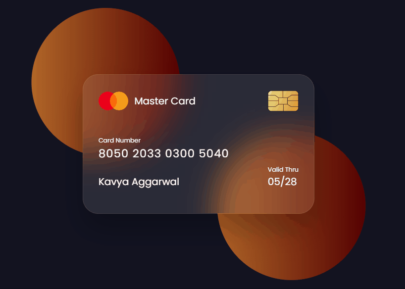

# Flipping-Card-UI Design

This project is a simple implementation of a flipping card user interface (UI) design using HTML and CSS. It showcases a card that flips when clicked, revealing content on the back. The project includes HTML, CSS, MIT license, and a .gitignore file to help you get started.

## Preview


## Files
- index.html - The HTML file contains the structure of the flipping card UI.
- style.css - The CSS file includes the styles and animations for the flipping card.
- sample.gif - A sample GIF demonstrating the flipping card UI.
- LICENSE - The MIT License file outlining the terms and conditions for using this project.
- .gitignore - A configuration file to specify which files and directories should be ignored by Git.
- logo.png chip.png- Images used in project.

## How to Use
1. Clone this repository to your local machine using Git:
   ```bash
   git clone https://github.com/Sais-27/Flipping-Card-UI.git
2. Open the [index.html](https://github.com/angle17kavya/Flipping-Card-UI/blob/main/index.html) file in a web browser to see the flipping card in action.

3. You can customize the content on the card by editing the HTML in the index.html file and adjust the styles in the style.css file to match your design preferences.

4. If you want to use the provided image in your project, download it from the repository and link to it in your HTML.

## Contributing
Feel free to contribute to this project by opening issues or creating pull requests. Your feedback and contributions are welcome.

## Acknowledgments
This project was inspired by various flipping card UI designs found on the web.

Thank you for using the Flipping Card UI Design project!

Enjoy flipping cards!
